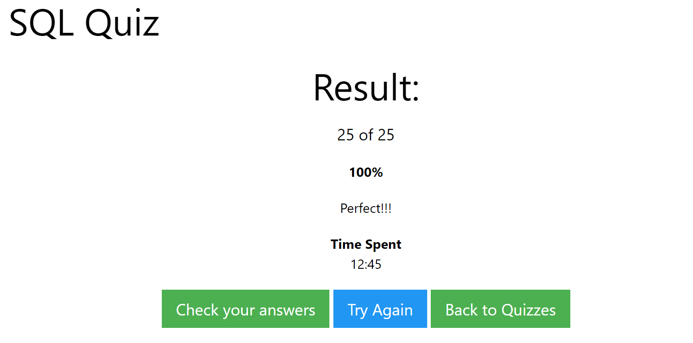

# My-MySQL-TUTORIAL

    故事要从一只蝙蝠说起...总之，从3月初我决定开始自学MySQL，到现在已经半个月了！在这里汇总一下我使用的资源。

    最近一次更新，刷题可以去leetcode，上面有数据库的练习，语言可选mysql Oracle ms-sql-serve。
  
## 目录
* [**课程教材**](#课程教材)
* [**网络资源**](#网络资源)
* [**建议自学线路**](#建议自学线路)
* [**需要学习的内容**](#需要学习的内容)
  
## 课程教材
   我院 **数据库** 课程所用教材为：《数据库系统概论(第5版)》 （王珊，萨师煊著ISBN：9787040406641），有配套的习题解析（都懂的）。
   这本书网上有带目录的高清电子资源。（直接硬读还挺累的，概念特别多，要有心理准备...

   注意：这本书说用语言为SQL，和MySQL有少许不同。例如SQL的trigger可以选'FOR EACH ROW'或者'FOR EACH STATEMENT'而MySQL只能选'FOR EACH ROW'。

  和16级打听了一下，《数据库系统概论》就讲前两篇的8个章节。我觉得按我院讲课难度，这门课程不需要额外的参考书...但我还是要推荐Abraham Silberschatz的《Database System Concepts》。如有余力，可以看看。

## 网络资源
### 教材网课
  众所周知，B站是个学习网站。
  
  教材的作者王珊老师在人大开设的数据库[课程.](https://www.bilibili.com/video/av20449194?p=1) 

  p.s.两倍速显得老师特别有活力😜
  
### 网上教程
  * [优达学堂 Udacity](https://cn.udacity.com/course/intro-to-relational-databases--ud197)
  
    这个课程相当的基础，感觉上很像MATLAB官网网课的风格。交互式，每小节只要十几分钟，轻松简单，适合入门。
    课程包括MySQL的最最最基础的知识和MySQL与Python的交互。要注意的是，这个课程篇幅太短，很多必要的知识都没讲。
  **可能需要科学上网**。
  
  * [MySQL-TUTORIAL](https://www.mysqltutorial.org/)
  
    我现在主要看这个。讲解清晰，配合例子，我很喜欢。里面有一丢丢错误，我把我发现的都[汇总](https://github.com/LucaJiang/My-MySQL-TUTORIAL/blob/master/bugs_in_MySQL_TUTORIAL)了。 **可能需要科学上网**。
  
  * [w3school](https://www.w3schools.com/)
  
    如果不是这玩意广告太烦人，我就看这个学习了。主要是用它配套的练习。
  
  * [YouTube](https://www.youtube.com/) 
  
    油管上有免费的MySQL课程（显然是全英文的），可以去看看。
  
## 建议自学线路
  我的建议不一定是最佳的线路，一是我也刚刚接触，二是每个人有自己的学习方式，适合自己的才是最好的。
  
* 线路一(我使用的)：
  ```
  优达学堂 -> MySQL-TUTORIAL(basic_tutorial) -> w3school的练习 -> 课程教材(前三章) -> MySQL-TUTORIAL(advanced_tutorial) -> 课程教材(第四、五章) -> 待定(我还没找到合适的教程) -> 课程教材(第二篇)
  ```
  我选这条路主要是不喜欢听课，而且u1s1教材写的很理论。
  
* 线路二:**不需要科学上网**:
  ```
  b站(教材, ppt)
  ```

* 线路三:
  ```
  油管 -> w3school的练习 -> 课程教材
  ```
  
最后一个小建议：要学会科学上网，学会自己找资源。  

PS：Udacity上其他的课程也挺好的，比如教使用git和github的。

2020-03-16 更新：w3school上的练习也太水了...


## 需要学习的内容
除了最最基础的，还需要掌握view 用户权限管理 触发 函数 过程 事件 才能完成这门课程的大作业.

//Transaction好像可以不用

**如果有其它资源欢迎联系我鸭！**
